[TOC]

# Chapter 1 简介

- ==这个项目依赖于 `CNN_Mobilenet_Training` 这个项目，在已完成项目列表里面可以寻找这个名字并阅读相关文档。==

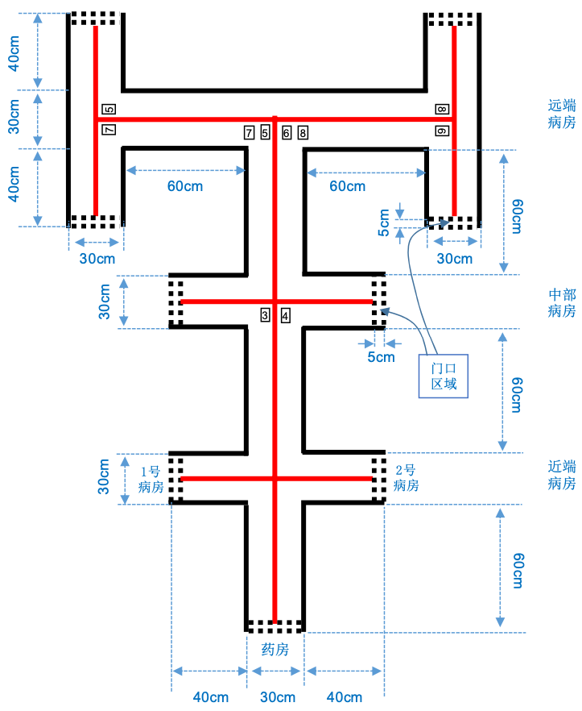

这个文档主要讲述的是2021年全国大学生电子设计竞赛F题中的==数字识别==这一技术分支，机械控制等相关的部分并不涉及。

这个技术分支需要有一个输入和一个输出，输入的是一个包含数字字模、场地边线和引导线的一张图片，输出则是将识别出的数字通过数组的方式显示出来。

下面这张图是竞赛组委会给提供的数字字模，为了降低难度，因此只提供了8个数字。

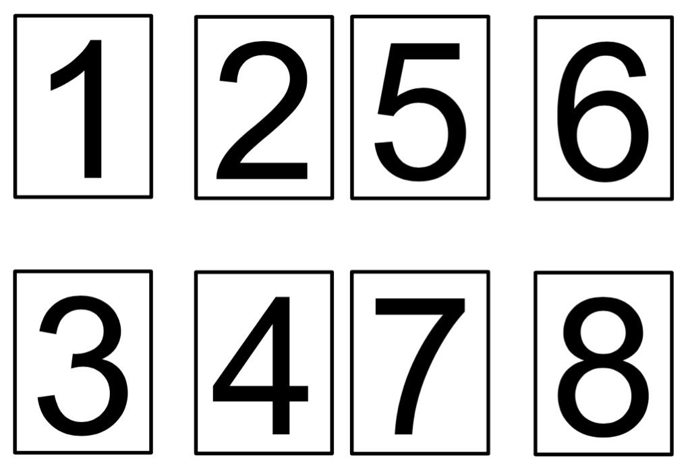

# Chapter 2 制作思路

## Section 1 环境与成像效果及思路

比赛场地基底底色为白色，环境为无阳光直射的自然光照明及顶置多灯照明环境，在正式比赛时不得有特殊照明条件要求，但是可以在摄像头前安装一个补光灯来消除环境对摄像头成像质量的影响。

场地的实际拍摄效果如下图所示：

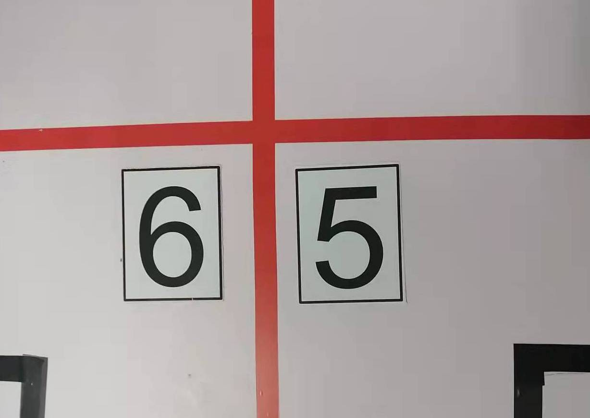

小车车载摄像头为树莓派专用的 3 Million Pixel 摄像头，由于传感器质量以及镜头质量，会出现残缺（镜头焦段原因）、偏色、模糊等情况。具体的示意如下图所示：

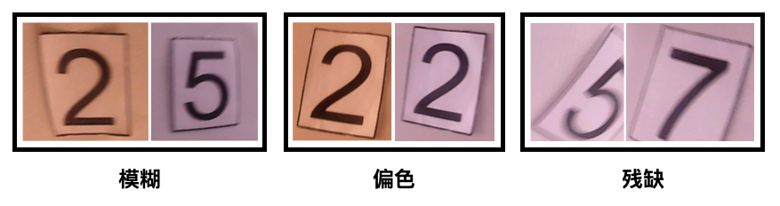

因此，我想出了如下的思路与方法：

- 采集数据集时，使用树莓派转用摄像头进行采集；
- 将原始数据利用二值化的方法转化为黑白图片；
- 训练时使用经过二值化处理过后的数据集；
- 在识别的时候，将拍摄到的照片进行二值化处理；
- 对图片进行resize操作；
- 通过设定的边框值对图片进行分割；
- 将不符合设定要求的图片删除；
- 识别剩下来的图片；

## Section 2 制作并训练数据集

首先先了解什么叫做二值图像

- 彩色图像有三个通道，RGB，每一个通道都有0~255，总共有2^24位空间；

- 灰度图像有一个通道，0~255，所以有256种灰度；
- ==二值图像只有两种颜色，黑和白==；

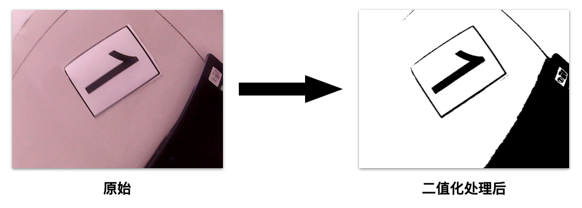

利用OpenCV中的函数即可完成这些操作，由于这部分并不是我处理的，因此我没有原始的代码；我从网上找到了一些能够运行得通的代码放在下面了：

```python
import cv2 as cv
import numpy as np

#全局阈值
def threshold_demo(image):
    gray = cv.cvtColor(image, cv.COLOR_RGB2GRAY)  #把输入图像灰度化
    #直接阈值化是对输入的单通道矩阵逐像素进行阈值分割。
    ret, binary = cv.threshold(gray, 0, 255, cv.THRESH_BINARY | cv.THRESH_TRIANGLE)
    print("threshold value %s"%ret)
    cv.namedWindow("binary0", cv.WINDOW_NORMAL)
    cv.imshow("binary0", binary)

#局部阈值
def local_threshold(image):
    gray = cv.cvtColor(image, cv.COLOR_RGB2GRAY)  #把输入图像灰度化
    #自适应阈值化能够根据图像不同区域亮度分布，改变阈值
    binary =  cv.adaptiveThreshold(gray, 255, cv.ADAPTIVE_THRESH_GAUSSIAN_C,cv.THRESH_BINARY, 25, 10)
    cv.namedWindow("binary1", cv.WINDOW_NORMAL)
    cv.imshow("binary1", binary)

#用户自己计算阈值
def custom_threshold(image):
    gray = cv.cvtColor(image, cv.COLOR_RGB2GRAY)  #把输入图像灰度化
    h, w =gray.shape[:2]
    m = np.reshape(gray, [1,w*h])
    mean = m.sum()/(w*h)
    print("mean:",mean)
    ret, binary =  cv.threshold(gray, mean, 255, cv.THRESH_BINARY)
    cv.namedWindow("binary2", cv.WINDOW_NORMAL)
    cv.imshow("binary2", binary)

src = cv.imread('E:/imageload/kobe.jpg')
cv.namedWindow('input_image', cv.WINDOW_NORMAL) #设置为WINDOW_NORMAL可以任意缩放
cv.imshow('input_image', src)
threshold_demo(src)
local_threshold(src)
custom_threshold(src)
cv.waitKey(0)
cv.destroyAllWindows()
```

对应代码的运行效果如下所示：

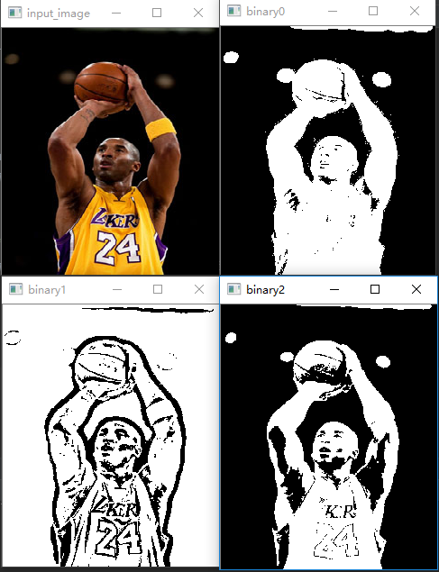

训练的结果的热力图和折线如下：

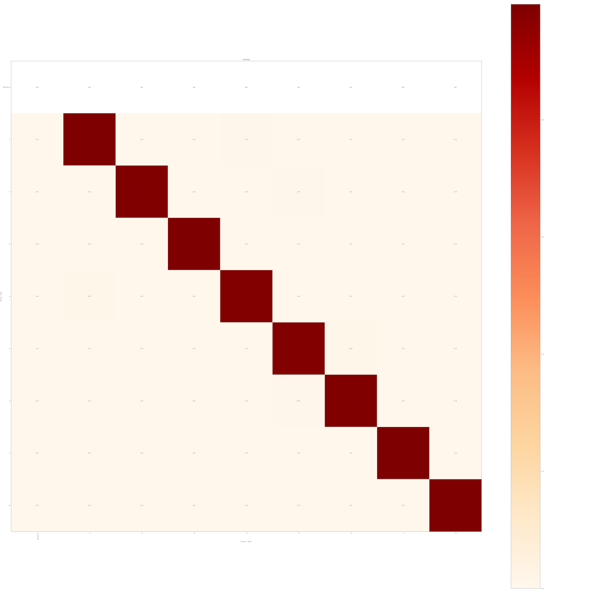

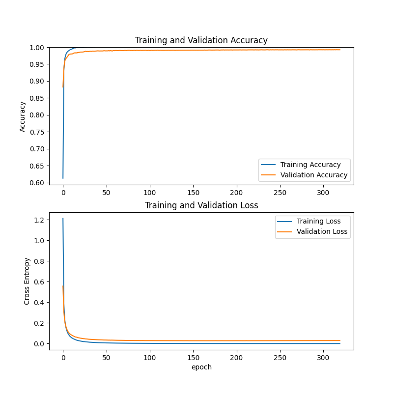

这个是第一次训练的结果，5千张320次训练，因为时间是在来不及，训练的次数太少，导致一些数字的识别率依然不行。

## Section 3 电脑环境配置

由于这一部分都和`CNN_Mobilenet_Training` 一致，于是我就复制过来了，当然了，有关CUDA部分可以直接略过。

首先电脑上需要安装Python 3.8 以及 conda 环境，可以通过 anaconda 进行安装

并创建一个新的conda环境。`yourEnvName`代表着你的新conda环境的名字。

```shell
conda create --name yourEnvName python=3.8
```

激活刚才创建的conda环境

```shell
windows ==> activate yourEnvName
linux/mac ==> source activate yourEnvName
```

常用的conda指令

```shell
conda info --envs：输出中带有【*】号的的就是当前所处的环境
conda list: 看这个环境下安装的包和版本
conda install numpy scikit-learn: 安装numpy sklearn包
conda env remove -n yourEnv: 删除你的环境
conda env list: 查看所有的环境
```

至于如何安装conda环境，可以单独安装也可以通过anaconda一起安装。

Windows上的开发环境比较特殊，需要先从Python官网下载Python安装包来安装Python，具体的安装版本为3.8，但实际测试3.7和3.9版本貌似也没什么太大问题，但我还是推荐安装3.8版本的。

Mac用户和Ubuntu用户则按照正常的方式安装就行，有啥问题可以自行百度或者Google。

至于说TensorFlow是安装CPU版本的还是GPU版本的，这个貌似是在2.0版本之后都整合到一个安装包里去了，程序会先检测你的电脑有无正确安装显卡以及对应的CUDA和CUDNN，如果能行就会使用GPU进行训练，没有的话就会使用CPU进行训练。

为了保证训练的速度，你的CPU最好支持AVX-2指令集或者AVX指令集。这样程序能正常运行，如果没有AVX指令集的话，要么换个电脑跑要么从TensorFlow官网下载一个支持不包含AVX指令集处理器的TensorFlow安装包进行安装。我要是没记错的话，貌似本次使用的TensorFlow2.3.1没有这个特殊的安装包。如果你说要换一个版本的TensorFlow呢？也不行，这个程序就支持2.3.1版本的TensorFlow，因为要使用到当中的一些特殊的API，高一个或者低一个版本都没有这个API，程序就没有办法跑，所以只能这样。

当时配这个环境配了差不多有一周才成功地让TensorFlow跑起来，又花了一周时间让TensorFlow在GPU上跑起来。安装过程简直痛苦至极。就像是被某个人强行按到床上一样难受。


至于说CUDA还有CUDNN的装法，这个还请自行百度、CSDN或者阅读NVIDIA和TensorFlow的官方文档，每一个组件的版本必须都要对应上，这就非常非常地难受，就算是全部都按照文档进行操作，也未必能跑起来，跟你的显卡驱动什么的都有关系，我上次就是因为驱动版本太高了，不行，降了驱动版本才运行起来的。每次看到报错我的心情能用下图进行解释：


扯远了，总之，跟NVIDIA扯上关系就会变得不幸，无论是安装过程，使用体验还是钱包。回归正题。

需要使用到的库文件列表已经制作到 `requirement.txt` 中，方便在换电脑之后进行安装。

这里需要强调一下，这个文件中的 TensorFlow 版本和 Panda 以及 Numpy 版本在树莓派上存在冲突，安装不上，需要手动先安装 TensorFlow ，这个时候会对另外两个库进行降级，等安装完之后再手动将那两个库升级回去，否则 Keras 就用不了。实测也没发生什么错误。

安装库文件的时候，在所创建的conda环境下，可以通过如下的命令进行安装

```shell
pip install -r requirement.txt 
```


安装完成之后会出现如上的提示。这个时候使用

```shell
pip list
```

检查一下库文件是否都安装成功。

如果`requirement.txt`丢失，可以通过下面的代码重建`requirement.txt`文件

```
absl-py==0.11.0
aliyun-iot-linkkit==1.2.3
astunparse==1.6.3
cachetools==4.1.1
certifi==2021.10.8
charset-normalizer==2.0.4
crcmod==1.7
cycler==0.10.0
docopt==0.6.2
gast==0.3.3
google-auth==1.23.0
google-auth-oauthlib==0.4.2
google-pasta==0.2.0
grpcio==1.34.0
h2==2.6.2
h5py==2.10.0
hpack==3.0.0
hyper==0.7.0
hyperframe==3.2.0
idna==3.2
imutils==0.5.4
keras==2.7.0
Keras-Preprocessing==1.1.2
kiwisolver==1.3.2
labelImg==1.8.6
lxml==4.6.4
Markdown==3.3.3
matplotlib==3.4.3
numpy==1.18.5
oauthlib==3.1.0
opencv-python==4.5.3.56
opt-einsum==3.3.0
paho-mqtt==1.5.1
pandas==1.3.2
Pillow==8.3.2
protobuf==3.14.0
pyasn1==0.4.8
pyasn1-modules==0.2.8
pyparsing==2.4.7
PyQt5==5.15.4
PyQt5-Qt5==5.15.2
PyQt5-sip==12.9.0
python-dateutil==2.8.2
pytz==2021.1
requests==2.26.0
requests-oauthlib==1.3.0
rsa==4.6
schedule==1.1.0
scipy==1.7.1
seaborn==0.11.2
six==1.16.0
stomp.py==7.0.0
tensorboard==2.4.0
tensorboard-plugin-wit==1.7.0
tensorflow==2.3.1
tensorflow-estimator==2.3.0
termcolor==1.1.0
tqdm==4.62.2
urllib3==1.26.6
Werkzeug==2.0.1
wrapt==1.12.1
```

## Section 4 程序讲解

### Part 1 从摄像头获取照片

```python
def take_pic(path,cam_v):
    cap = cv2.VideoCapture(cam_v)
    ret, frame = cap.read()
    cv2.imwrite(path, frame)
```

- @path ：拍摄后的图片保存地址；
- @cam_v ：选择要调用第几个摄像头 通常来讲设置为 ”0“ 即可；


### Part 2 按照阈值裁剪照片

```python
ic.images_cut_img_input(PATH,BIN_LOW,BIN_HIGH)
```

```python
PATH = './images/IMG_9281.JPG'  #要处理的图片路径
BIN_LOW = 27					#设定二值化
BIN_HIGH = 255
```

参数传入到下面的这个函数当中

```python
def images_cut_img_input(IMG_PATH,BIN_LOW,BIN_HIGH):
    img = cv.imread(IMG_PATH)
    img_gray = cv.cvtColor(img, cv.COLOR_BGR2GRAY)  # 函数的返回值为转换之后的图像
    # 通常为25，255
    ret, th1 = cv.threshold(img_gray, BIN_LOW, BIN_HIGH, cv.THRESH_BINARY)
    # 二值化处理之后的图片只有 0 和 255  0为黑 255 为白
    img_list = cut_image_by_projection(th1)
    count = 1
    file_operate.custom_rmdir('./predict/data/')
    #time.sleep(10)
    for i in img_list:
        # 这里可以对切割到的图片进行操作，显示出来或者保存下来
        cv.imwrite('./predict/data/'+str(count) + '.jpg', i)
        count += 1
```

通过其中的`threshold`将图片转化为二值图片。当中的`img_gray`参数对应的是`cv.cvtColor(img, cv.COLOR_BGR2GRAY)`

`cvtColor`的功能是实现对图片色彩空间的转换，函数形式如下

```python
void cvCvtColor( const CvArr* src, CvArr* dst, int code );
#每一部分参数的解释如下
src：源图像（输入的 8-bit , 16-bit 或 32-bit 单倍精度浮点数影像）

dst：目标图像（输入的 8-bit , 16-bit 或 32-bit 单倍精度浮点数影像）
```

这里的 `int code` 是有关色彩空间转换的代码，可用的代码如下展示

```python
RGB <--> BGR：CV_BGR2BGRA、CV_RGB2BGRA、CV_BGRA2RGBA、CV_BGR2BGRA、CV_BGRA2BGR

RGB <--> 5X5：CV_BGR5652RGBA、CV_BGR2RGB555、（以此类推，不一一列举）

RGB <---> Gray：CV_RGB2GRAY、CV_GRAY2RGB、CV_RGBA2GRAY、CV_GRAY2RGBA

RGB <--> CIE XYZ：CV_BGR2XYZ、CV_RGB2XYZ、CV_XYZ2BGR、CV_XYZ2RGB

RGB <--> YCrCb（YUV） JPEG：CV_RGB2YCrCb、CV_RGB2YCrCb、CV_YCrCb2BGR、CV_YCrCb2RGB、CV_RGB2YUV（将YCrCb用YUV替代都可以）

RGB <--> HSV：CV_BGR2HSV、CV_RGB2HSV、CV_HSV2BGR、CV_HSV2RGB

RGB <--> HLS：CV_BGR2HLS、CV_RGB2HLS、CV_HLS2BGR、CV_HLS2RGB

RGB <--> CIE L*a*b*：CV_BGR2Lab、CV_RGB2Lab、CV_Lab2BGR、CV_Lab2RGB

RGB <--> CIE L*u*v：CV_BGR2Luv、CV_RGB2Luv、CV_Luv2BGR、CV_Luv2RGB

RGB <--> Bayer：CV_BayerBG2BGR、CV_BayerGB2BGR、CV_BayerRG2BGR、CV_BayerGR2BGR、CV_BayerBG2RGB、CV_BayerGB2RGB、 CV_BayerRG2RGB、CV_BayerGR2RGB（在CCD和CMOS上常用的Bayer模式）

YUV420 <--> RGB：CV_YUV420sp2BGR、CV_YUV420sp2RGB、CV_YUV420i2BGR、CV_YUV420i2RGB
```

我这里只用到了两个参数，即：src 和 int code。

还需要注意一点，OpenCV的默认图片通道顺序是==BGR==不是==RGB!!!==

接下来就是对图片进行投影切割

```python
img_list = cut_image_by_projection(th1)
```

这个函数有三种切割模式，我为了能够更加准确地将字模切割出来，我选择了水平和竖直两次切割。

```python
def cut_image_by_projection(img, cvalue=255, patern=2):
    """
    传入二值化处理之后的图片 通过投影切割获取每个单独的数字
    处理方法默认为先水平切割再竖直切割
    :param cvalue: 根据切个数值，默认为255（根据白色切割），可选择0（根据黑色切割）
    :param img:传入的二值化图片
    :param patern: 2 为水平竖直两次切割，0 为水平切割， 1 为竖直切割
    :return: 返回切割完成后的图片数组
    """
    if patern == 2:
        return cut_vertical(cut_level(img, cvalue=cvalue), cvalue=cvalue)
    elif patern == 1:
        return cut_vertical(img, cvalue=cvalue)
    else:
        return cut_level(img, cvalue=cvalue)
```

这里根据白色进行切割，也就是说，把黑色边线或者黑色边框进行保留。当然也包括了那些场地边线和引导线。

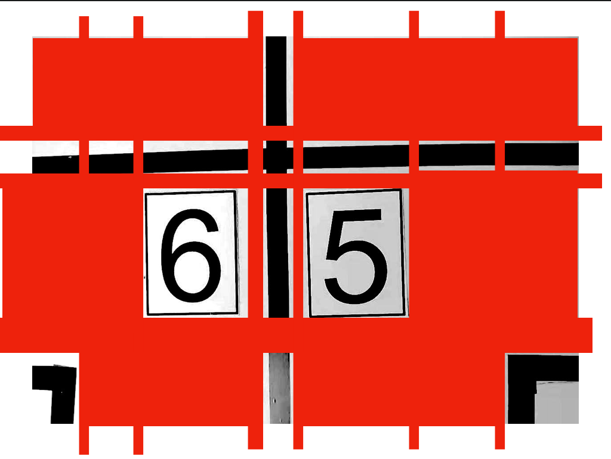

这张示意图（我只是用图片编辑软件进行灰度处理了，未做二值化处理）中的红色色块部分表示的是切割部分，切割出来的小的部分中，含有黑色的就进行保留，不含的直接remove。因此这张示意图留下来的部分就是中间的”6“，“5”数字字模、场地边线和引导线。

切割好的照片放在了`predict/data`目录之下。按照从上到下，从左到右的顺序对图片进行编号。

### Part 3 筛选照片

筛选照片的数值和原始照片大小和摄像头安装位置有关系，这里的照片是由 3 Million Pixel 摄像头拍摄的，尺寸为 640 x 480，因此我设定数字字模的筛选尺寸为 70 x 80，筛选出来的结果和准确度都还可以，在所有的情况下（停歪了，残缺，模糊）都能准确地将数字字模的区域裁剪出来。

```python
import os
from PIL import Image
import glob
dir1 = './predict/data'  # 图片文件存放地址

def images_select(MAX_WIDTH,MAX_HEIGHT):
    paths = glob.glob(os.path.join(dir1, '*.jpg'))
    # 输出所有文件和文件夹
    for file in paths:
        fp = open(file, 'rb')
        img = Image.open(fp)
        fp.close()
        width = img.size[0]
        height = img.size[1]
        if (width <= MAX_WIDTH) or (height <= MAX_HEIGHT):
            os.remove(file)
```

将该路径下的全部照片进行遍历，判断是否符合设定的尺寸，不符合的直接remove掉。

### Part 4 识别照片

这个是最为关键的一个步骤

先在`main.py`提前预加载模型，这样能减少5~6秒的模型加载时间。

```python
model = tf.keras.models.load_model("models/number_rcog_mobilenet.h5")
```

模型通过不断传参的方式传入到`def start_recognize(model)`函数当中。

```python
class_names = ['1','2','3','4','5','6','7','8']  # 这个数组在模型训练的开始会输出
```

这个类名的具体来源和使用方法请参照 `CNN_Mobilenet_Training` 项目的文档。

由于我使用的是macOS系统，系统会自动生成一个名为`.DS_Store`的文件，因此应当先检测这个文件是否存在于目标路径当中，存在的话删除掉即可。

```python
predict_dir = './predict/'
test = os.listdir(predict_dir)
if '.DS_Store' in test:
    test.remove('.DS_Store')
```

删除掉之后，将每一张图片的路径保存到`images`这个数组当中

```python
	#新建一个列表保存预测图片的地址
    images = []
    #获取每张图片的地址，并保存在列表images中
    for testpath in test:  #循环获取测试路径底下需要测试的图片
        for fn in os.listdir(os.path.join(predict_dir, testpath)):
            if fn.endswith('JPG'):
                fd = os.path.join(predict_dir, testpath, fn)
                #print(fd)
                images.append(fd)
            elif fn.endswith('jpg'):
                fd = os.path.join(predict_dir, testpath, fn)
                #print(fd)
                images.append(fd)
            elif fn.endswith('png'):
                fd = os.path.join(predict_dir, testpath, fn)
                #print(fd)
                images.append(fd)
```

通常来讲，这个顺序问题不用被考虑到，因此在切割的时候就已经按照规则进行排序了，除非是小车并没有按照规定的方式停车或者行走，那我也没有办法，毕竟四天三夜没有时间考虑那么多问题。

接下来就进入到了识别的程序块了。

```python
result_list = []
for img in images:
    imgpath = img
    img_init = cv2.imread(img)
    img_init = cv2.resize(img_init, (224, 224))  # 将图片大小调整到224*224用于模型推理
    cv2.imwrite(img, img_init)
    img = Image.open(img)  # 读取图片
    img = np.asarray(img)  # 将图片转化为numpy的数组
    outputs = model.predict(img.reshape(1, 224, 224, 3))  # 将图片输入模型得到结果
    result_index = int(np.argmax(outputs))
    result = class_names[result_index]
    #result.setText(result)
    #return img,result #返回图片地址和识别出的数字
    imgf = imgpath.split('/')[3]
    imgb = imgf.split('.')[0]
    #print(result)
    result_list.append([imgb,result])

result_list = sorted(result_list, key=(lambda x:x[0]))
```

这里需要对程序进行解释，首先为何要对图片进行resize操作，因为我在训练模型的时候，选择的就是224x224，如果我在调用模型进行识别的时候图片分辨率不是224x224，程序就会报错。如果要使用其他尺寸的图片进行识别，那么在训练的时候就要设置好。

最终识别完之后返回的格式就是 ==[[序号，识别结果]，[序号，识别结果]，[序号，识别结果]，[序号，识别结果]]==。

具体的效果如下图所示，结果为 ”5523“ 结果完全没有问题。

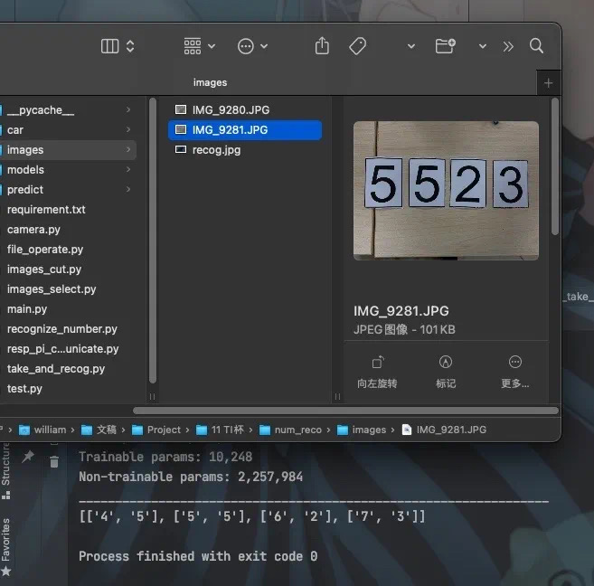

# Chapter 3 小结

由于对于应用场景分析失误，导致这套程序在树莓派上运行非常缓慢，我后来就看了很久相关的解决方法，就是在对程序进行训练的时候，应当使用INT8模型量化，也就是8 Bit，而非目前使用的float 32（我忘记是float32 还是 float 64了，反正挺大的），这就需要对训练的程序进行大浮动改动了，我没有这个能力改程序，因此也就没有办法进行验证。然后训练使用的数据集的图片尺寸也应适当降低，640x480的分辨率太高了，应当降低到64x48的分辨率即可。而识别用的照片分辨率也应该是64x48或者更低，这样才能在树莓派这种低性能的机器上运行起来。

总之，这篇文档涉及到了TensorFlow的应用，自己训练的数据集的应用以及小部分的OpenCV的应用。

希望部分代码，思路能够有所帮助。

限于本人水平，如果文档和代码有表述不当之处，还请不吝赐教，对文档按照整体行文结构规范进行补充与修改。


# Chapter 4 完整程序

程序的完成目录如下

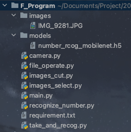

其中的models里的模型需要根据 `CNN_Mobilenet_Training` 项目进行训练。

images里的照片务必使分辨率为640x480然后命名一致即可。

这样就可以在丢失程序的情况下对项目进行重建。

## Section 1 main.py

```python
import take_and_recog
import tensorflow as tf

def TwoDConverToOneD(List):
    new_list = []
    for line in List:
        new_list.append(line[1])
    return new_list

if __name__ == '__main__':
    model = tf.keras.models.load_model("models/number_rcog_mobilenet.h5")
    print(TwoDConverToOneD(take_and_recog.photo_take_and_recog(model)))
```

## Section 2 camera.py

```python
import cv2

def take_pic(path,cam_v):
    cap = cv2.VideoCapture(cam_v)
    ret, frame = cap.read()
    cv2.imwrite(path, frame)
```

## Section 3 take_and_recog.py

```python
import images_cut as ic
import images_select
import recognize_number
import camera

def photo_take_and_recog(model):
    # 要裁剪的照片的保存地址和阈值设置参数
    PATH = './images/IMG_9281.JPG'
    BIN_LOW = 27
    BIN_HIGH = 255

    # 筛选照片的长宽参数
    MAX_WIDTH = 70      #70，80
    MAX_HEIGHT = 80

    #camera.take_pic(PATH,0) #拍照保存路径和相机位
    #按照阈值设置裁剪照片
    ic.images_cut_img_input(PATH,BIN_LOW,BIN_HIGH)
    #筛选出数字牌的区域
    images_select.images_select(MAX_WIDTH,MAX_HEIGHT)

    return recognize_number.start_recognize(model)
```

## Section 4 images_cut.py

```python
import cv2 as cv
import numpy as np
import file_operate
import time

def count_number(num_list, num):
    """
    统计一维数组中某个数字的个数
    :param num_list:
    :param num:
    :return: num的数量
    """
    t = 0
    for i in num_list:
        if i == num:
            t += 1
    return t


def cut_level(img, cvalue=255):
    """
    投影法水平切割一张图片 主要处理多行文本
    :param cvalue:  切割线的颜色
    :param img: 传入为一张图片
    :return: 水平切割之后的图片数组
    """
    r_list = []
    end = 0
    for i in range(len(img)):
        if count_number(img[i], cvalue) >= img.shape[1]:
            star = end
            end = i
            if end - star > 1:
                # 如果相差值大于一的时候就说明跨过待切割的区域，
                # 根据 star 和end 的值就可以获取区域
                r_list.append(img[star:end, :])
    return r_list


def cut_vertical(img_list, cvalue=255):
    """
    投影法竖直切割图片的数组
    :param img_list: 传入的数据为一个由（二维）图片构成的数组，不是单纯的图片
    :param cvalue: 切割的值 同cut_level中的cvalue
    :return: 切割之后的图片的数组
    """
    # 如果传入的是一个普通的二值化的图片，则需要首先将这个二值化的图片升维为图片的数组
    if len(np.array(img_list).shape) == 2:
        img_list = img_list[None]
    r_list = []
    for img_i in img_list:
        end = 0
        for i in range(len(img_i.T)):
            if count_number(img_i.T[i], cvalue) >= img_i.shape[0]:
                star = end
                end = i
                if end - star > 1:
                    r_list.append(img_i[:, star:end])
    return r_list


def cut_image_by_projection(img, cvalue=255, patern=2):
    """
    传入二值化处理之后的图片 通过投影切割获取每个单独的数字
    处理方法默认为先水平切割再竖直切割
    :param cvalue: 根据切个数值，默认为255（根据白色切割），可选择0（根据黑色切割）
    :param img:传入的二值化图片
    :param patern: 2 为水平竖直两次切割，0 为水平切割， 1 为竖直切割
    :return: 返回切割完成后的图片数组
    """
    if patern == 2:
        return cut_vertical(cut_level(img, cvalue=cvalue), cvalue=cvalue)
    elif patern == 1:
        return cut_vertical(img, cvalue=cvalue)
    else:
        return cut_level(img, cvalue=cvalue)


def images_cut_img_input(IMG_PATH,BIN_LOW,BIN_HIGH):
    img = cv.imread(IMG_PATH)
    img_gray = cv.cvtColor(img, cv.COLOR_BGR2GRAY)  # 函数的返回值为转换之后的图像
    # 通常为25，255
    ret, th1 = cv.threshold(img_gray, BIN_LOW, BIN_HIGH, cv.THRESH_BINARY)
    # 二值化处理之后的图片只有 0 和 255  0为黑 255 为白
    img_list = cut_image_by_projection(th1)
    count = 1
    file_operate.custom_rmdir('./predict/data/')
    #time.sleep(10)
    for i in img_list:
        # 这里可以对切割到的图片进行操作，显示出来或者保存下来
        cv.imwrite('./predict/data/'+str(count) + '.jpg', i)
        count += 1
```

## Section 5 file_operate.py

```python
import os
import shutil

def custom_rmdir(rootdir):
    filelist=os.listdir(rootdir)
    for f in filelist:
      filepath = os.path.join( rootdir, f )
      if os.path.isfile(filepath):
        os.remove(filepath)
        #print(filepath+" removed!")
      elif os.path.isdir(filepath):
        shutil.rmtree(filepath,True)
        #print("dir "+filepath+" removed!")
```

## Section 6 images_select.py

```python
import os
from PIL import Image
import glob
dir1 = './predict/data'  # 图片文件存放地址

def images_select(MAX_WIDTH,MAX_HEIGHT):
    paths = glob.glob(os.path.join(dir1, '*.jpg'))
    # 输出所有文件和文件夹
    for file in paths:
        fp = open(file, 'rb')
        img = Image.open(fp)
        fp.close()
        width = img.size[0]
        height = img.size[1]
        if (width <= MAX_WIDTH) or (height <= MAX_HEIGHT):
            os.remove(file)
```

## Section 7 recognize_number.py

```python
import os
import numpy as np
import cv2
from PIL import Image


def start_recognize(model):
    model.summary() #输出模型各层的参数状况
    class_names = ['1','2','3','4','5','6','7','8']  # 这个数组在模型训练的开始会输出
    #要预测的图片保存在这里
    predict_dir = './predict/'
    test = os.listdir(predict_dir)
    if '.DS_Store' in test:
        test.remove('.DS_Store')
    #新建一个列表保存预测图片的地址
    images = []
    #获取每张图片的地址，并保存在列表images中
    for testpath in test:  #循环获取测试路径底下需要测试的图片
        for fn in os.listdir(os.path.join(predict_dir, testpath)):
            if fn.endswith('JPG'):
                fd = os.path.join(predict_dir, testpath, fn)
                #print(fd)
                images.append(fd)
            elif fn.endswith('jpg'):
                fd = os.path.join(predict_dir, testpath, fn)
                #print(fd)
                images.append(fd)
            elif fn.endswith('png'):
                fd = os.path.join(predict_dir, testpath, fn)
                #print(fd)
                images.append(fd)
    result_list = []
    for img in images:
        imgpath = img
        #print(img)
        img_init = cv2.imread(img)
        img_init = cv2.resize(img_init, (224, 224))  # 将图片大小调整到224*224用于模型推理
        cv2.imwrite(img, img_init)
        img = Image.open(img)  # 读取图片
        img = np.asarray(img)  # 将图片转化为numpy的数组
        outputs = model.predict(img.reshape(1, 224, 224, 3))  # 将图片输入模型得到结果
        result_index = int(np.argmax(outputs))
        result = class_names[result_index]
        #result.setText(result)
        #return img,result #返回图片地址和识别出的数字

        imgf = imgpath.split('/')[3]
        imgb = imgf.split('.')[0]
        #print(result)
        result_list.append([imgb,result])

    result_list = sorted(result_list, key=(lambda x:x[0]))

    return result_list #返回二维列表，第一项是照片顺序大小，第二项是识别出后的数字
```
